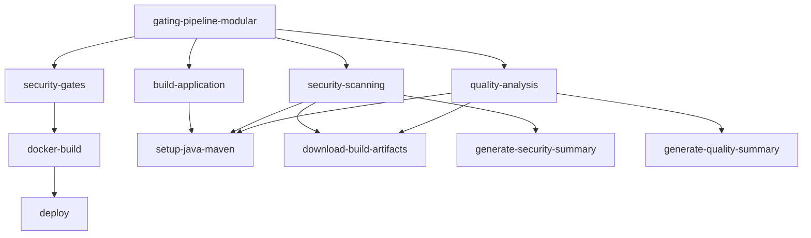

# GitHub Actions Workflows Documentation

## Overview

This directory contains the CI/CD workflows for the Security Gating Platform. The workflows are organized in a modular architecture for better maintainability, reusability, and performance.

## Workflow Architecture Comparison

### Modular vs Monolithic

| Aspect | Modular Pipeline | Monolithic Pipeline |
|--------|-----------------|-------------------|
| **File Size** | ~270 lines | 991 lines |
| **Maintainability** | High - separated concerns | Low - single large file |
| **Reusability** | High - reusable workflows | None - all inline |
| **Testing** | Easy - test individual components | Hard - test entire pipeline |
| **Performance** | Better parallelization | Sequential execution |
| **Debugging** | Easier - isolated components | Harder - navigate large file |
| **Production Ready** | ✅ Yes | ❌ Reference only |

## Available Workflows

### Main Pipelines

#### 1. `gating-pipeline-modular.yml` (Production)
**Purpose:** Production-ready modular CI/CD pipeline with security and quality gates

**Triggers:**
- Push to `main` or `develop` branches
- Pull requests to `main`
- Manual workflow dispatch with override options

**Jobs:**
1. **Build** → Calls `build-application.yml`
2. **Security Scan** → Calls `security-scanning.yml`
3. **Code Quality** → Calls `quality-analysis.yml` (parallel with Security Scan)
4. **Security Gates** → Evaluates combined gates
5. **Build Docker Image** → Calls `docker-build.yml`
6. **Deploy** → Production deployment

**Key Features:**
- Modular architecture with reusable workflows
- Parallel execution of security and quality scans
- Role-based gate override support
- Comprehensive audit logging

#### 2. `gating-pipeline-monolithic.yml` (Reference)
**Purpose:** Original single-file implementation kept for reference

**Triggers:**
- Manual workflow dispatch only (automatic triggers disabled)

**Note:** This workflow is maintained for comparison purposes but should not be used in production.

#### 3. `ci-pipeline.yml`
**Purpose:** Simple CI demonstration workflow

**Triggers:**
- Manual workflow dispatch

**Jobs:**
- Basic build and test execution

### Reusable Workflows

#### 1. `build-application.yml`
**Purpose:** Builds and packages the Spring Boot application

**Inputs:**
- `java-version` (default: '17')
- `maven-version` (default: '3.8.6')

**Outputs:**
- Build artifacts uploaded for downstream jobs

**Steps:**
1. Checkout code
2. Setup Java and Maven (uses composite action)
3. Build Spring Boot application
4. Package application
5. Upload artifacts

#### 2. `security-scanning.yml`
**Purpose:** Performs comprehensive security scanning using Snyk

**Inputs:**
- `java-version` (default: '17')
- `run-container-scan` (default: false)

**Secrets Required:**
- `SNYK_TOKEN`
- `SNYK_ORG_ID`

**Outputs:**
- `critical-count`: Number of critical vulnerabilities
- `high-count`: Number of high vulnerabilities
- `medium-count`: Number of medium vulnerabilities
- `low-count`: Number of low vulnerabilities

**Steps:**
1. Setup environment
2. Download build artifacts
3. Validate Snyk configuration
4. Run dependency scan
5. Run SAST (Static Application Security Testing)
6. Optional: Container image scanning
7. Generate security summary
8. Upload results

#### 3. `quality-analysis.yml`
**Purpose:** Performs code quality analysis using SonarQube Cloud

**Inputs:**
- `java-version` (default: '17')

**Secrets Required:**
- `SONAR_TOKEN`
- `SONAR_ORGANIZATION`
- `SONAR_PROJECT_KEY`

**Outputs:**
- `quality-gate-status`: PASSED/FAILED/UNKNOWN
- `sonarqube-configured`: Configuration status
- `sonar-gate-exit-code`: Exit code from analysis

**Steps:**
1. Setup environment
2. Download build artifacts
3. Validate SonarQube configuration
4. Run SonarQube analysis
5. Generate quality summary
6. Upload results

#### 4. `docker-build.yml`
**Purpose:** Builds Docker images for deployment

**Inputs:**
- `image-tag` (default: 'latest')
- `load-prebuilt-image` (default: true)

**Steps:**
1. Setup Docker Buildx
2. Load or build Docker image
3. Tag image appropriately
4. Save image for deployment
5. Upload Docker artifact

## Workflow Dependencies



## Using Reusable Workflows

### In Same Repository

```yaml
jobs:
  build:
    uses: ./.github/workflows/build-application.yml
    with:
      java-version: '17'
```

### From External Repository

```yaml
jobs:
  build:
    uses: org/repo/.github/workflows/build-application.yml@main
    with:
      java-version: '17'
    secrets:
      SNYK_TOKEN: ${{ secrets.SNYK_TOKEN }}
```

## Composite Actions Used

The workflows leverage several composite actions for common tasks:

1. **`setup-java-maven`** - Standardized Java/Maven setup with caching
2. **`download-build-artifacts`** - Consistent artifact download
3. **`generate-security-summary`** - Snyk results parsing and reporting
4. **`generate-quality-summary`** - SonarQube results parsing and reporting

See [../actions/README.md](../actions/README.md) for detailed documentation.

## Workflow Dispatch Parameters

### `gating-pipeline-modular.yml` Parameters

| Parameter | Type | Default | Description |
|-----------|------|---------|-------------|
| `override_gates` | choice | 'false' | Override security gates (requires approval) |
| `user_role` | choice | 'ci-pipeline' | User role for testing |

**User Role Options:**
- `ci-pipeline` - Standard CI pipeline role
- `developer` - Developer role
- `editor` - Editor role with override capabilities
- `security-admin` - Security administrator role

## Environment Variables

### Global Environment Variables

```yaml
env:
  JAVA_VERSION: '17'
  MAVEN_VERSION: '3.8.6'
  DOCKER_BUILDKIT: 1
  PDP_URL: http://localhost:7766
```

### Required Secrets

| Secret | Description | Used By |
|--------|-------------|---------|
| `PERMIT_API_KEY` | Permit.io API key | Security gates |
| `SNYK_TOKEN` | Snyk authentication token | Security scanning |
| `SNYK_ORG_ID` | Snyk organization ID | Security scanning |
| `SONAR_TOKEN` | SonarQube Cloud token | Quality analysis |
| `SONAR_ORGANIZATION` | SonarQube organization | Quality analysis |
| `SONAR_PROJECT_KEY` | SonarQube project key | Quality analysis |

## Migrating from Monolithic to Modular

To switch from the monolithic to modular pipeline:

1. **Update branch protection rules** to use `gating-pipeline-modular`
2. **Verify all secrets** are configured
3. **Test in feature branch** first
4. **Monitor initial runs** for any issues

See [../../docs/MIGRATION.md](../../docs/MIGRATION.md) for detailed migration guide.

## Troubleshooting

### Common Issues

#### 1. Artifact Not Found
**Error:** "Artifact not found"
**Solution:** Ensure build job completed successfully and artifact names match

#### 2. Reusable Workflow Not Found
**Error:** "Invalid workflow file"
**Solution:** Check workflow paths are correct and files exist

#### 3. Secret Not Available
**Error:** "Secret not found"
**Solution:** Ensure secrets are passed correctly to reusable workflows

#### 4. Node.js Deprecation Warnings
**Issue:** Buffer() deprecation warnings in logs
**Impact:** Low - just warnings from GitHub Actions internals
**Solution:** Will be resolved when GitHub updates their actions

#### 5. Audit Logs Missing
**Issue:** Audit logs not appearing in Permit.io dashboard
**Root Cause:** Missing audit log processing steps in pipeline
**Solution:** ✅ **RESOLVED** - Modular pipeline now includes:
- 10-second wait for audit log transmission
- PDP log verification step
- Enhanced authorization context with dashboard links

**Success Verification:**
Look for this message in PDP logs: `permit-pdp | INFO | Logs uploaded successfully`

For detailed troubleshooting, see [CLAUDE.md](../../CLAUDE.md#audit-log-issues)

### Debug Mode

Enable debug logging by setting repository secret:
- `ACTIONS_STEP_DEBUG` = `true`

## Performance Metrics

### Typical Execution Times

| Job | Modular | Monolithic | Improvement |
|-----|---------|------------|-------------|
| Build | 2-3 min | 2-3 min | Same |
| Security + Quality | 3-4 min | 6-7 min | 45% faster (parallel) |
| Gates | 1-2.2 min | 1-2 min | +10s for audit processing |
| Docker | 1 min | 1 min | Same |
| **Total** | **7-10.2 min** | **10-13 min** | **~30% faster** |

**Note:** Gates execution includes 10-second audit log processing for complete compliance visibility in Permit.io dashboard.

## Best Practices

1. **Always use reusable workflows** for complex jobs
2. **Keep composite actions focused** on single responsibilities
3. **Version your workflows** when making breaking changes
4. **Test in feature branches** before merging to main
5. **Monitor performance** and optimize bottlenecks
6. **Document changes** in workflow files
7. **Use semantic versioning** for reusable components

## Contributing

When modifying workflows:

1. **Test locally** using `act` tool if possible
2. **Update documentation** in this README
3. **Version appropriately** for breaking changes
4. **Maintain backward compatibility** when possible
5. **Add comments** for complex logic

## Support

For issues or questions:
- Check workflow logs in GitHub Actions tab
- Review this documentation
- Check [composite actions documentation](../actions/README.md)
- Enable debug mode for detailed logs