# CI/CD Security Gating Flow - Sequence Diagram

This document provides comprehensive sequence diagrams showing the complete CI/CD security gating flow with Permit.io integration.

## Main CI/CD Pipeline Flow

## Gate Evaluation Detail Flow

```mermaid
sequenceDiagram
    participant Script as evaluate-gates.sh
    participant ENV as Environment
    participant Snyk as Snyk Results
    participant PDP as Permit.io PDP
    participant OPA as OPA Engine
    participant Policy as Rego Policy

    Note over Script, Policy: Detailed Gate Evaluation Process

    Script->>ENV: Load .env file if PERMIT_API_KEY not set
    Script->>ENV: Check PERMIT_API_KEY availability
    alt API Key Missing
        Script->>Script: Exit with error code 2
    end
    
    Script->>PDP: curl http://localhost:7001/healthy (readiness check)
    loop Max 30 attempts, 2s interval
        PDP-->>Script: Health status
        alt PDP Ready
            Script->>Script: ✓ PDP is ready
        else PDP Not Ready
            Script->>Script: Wait 2 seconds, retry
        end
    end
    
    Script->>Snyk: Read snyk-results.json
    Script->>Script: Extract vulnerability counts with jq
    Note right of Script: CRITICAL_COUNT = critical vulnerabilities<br/>HIGH_COUNT = high vulnerabilities<br/>MEDIUM_COUNT = medium vulnerabilities<br/>LOW_COUNT = low vulnerabilities
    
    Script->>Script: Create Permit.io payload
    Note right of Script: Include user role (ci-pipeline/editor)<br/>vulnerability data, context info
    
    Script->>PDP: POST /allowed with authorization payload
    Note right of Script: Headers: Authorization: Bearer ${PERMIT_API_KEY}<br/>Content-Type: application/json
    
    PDP->>OPA: Evaluate request against policies
    OPA->>Policy: Execute gating_policy.rego
    
    Policy->>Policy: Check hard_gate_fail (critical > 0)
    Policy->>Policy: Check soft_gate_warn (high > 0)
    Policy->>Policy: Check medium_warn (medium > 0)
    
    alt Critical Vulnerabilities Found
        Policy->>Policy: hard_gate_fail = true
        Policy->>OPA: Return FAIL decision
    else High Vulnerabilities Found (no critical)
        Policy->>Policy: soft_gate_warn = true
        Policy->>OPA: Return PASS_WITH_WARNINGS
    else Medium Vulnerabilities Found (no critical/high)
        Policy->>Policy: medium_warn = true
        Policy->>OPA: Return PASS_WITH_INFO
    else No Vulnerabilities
        Policy->>OPA: Return PASS
    end
    
    OPA->>PDP: Policy evaluation result
    PDP-->>Script: JSON response {allow: boolean, decision: string, violations: []}
    
    Script->>Script: Parse PDP response
    Script->>Script: Determine decision based on allow field and counts
    
    alt Decision: PASS
        Script->>Script: ✅ DECISION: PASS - All security gates passed
        Script->>Script: Exit code 0
    else Decision: EDITOR_OVERRIDE
        Script->>Script: 🔓 DECISION: EDITOR OVERRIDE - Deployment allowed with editor privileges
        Script->>Script: Log audit trail (user, vulnerabilities, justification)
        Script->>Script: Exit code 0
    else Decision: PASS_WITH_WARNINGS
        Script->>Script: ⚠️ DECISION: PASS WITH WARNINGS - Soft gate triggered
        Script->>Script: Display high severity vulnerabilities
        Script->>Script: Exit code 1 (warning)
    else Decision: PASS_WITH_INFO
        Script->>Script: ℹ️ DECISION: PASS WITH INFO - Informational findings
        Script->>Script: Display medium severity vulnerabilities
        Script->>Script: Exit code 1 (warning)
    else Decision: FAIL
        Script->>Script: ❌ DECISION: FAIL - Hard gate triggered
        Script->>Script: Display critical vulnerabilities and recommendations
        Script->>Script: Exit code 2 (failure)
    end
```

## Editor Override Flow

## Configuration and Environment Setup

## Key Components

### Exit Codes
- **0**: All gates passed (or editor override active)
- **1**: Soft gate warning (non-blocking)
- **2**: Hard gate failure (blocking)

### User Roles
- **ci-pipeline**: Standard CI/CD role with normal gate enforcement
- **editor**: Override role for emergency deployments with audit trail

### Gate Types
- **Hard Gate**: Critical vulnerabilities block deployment
- **Soft Gate**: High vulnerabilities warn but allow deployment
- **Info Gate**: Medium vulnerabilities provide informational warnings

### Security Considerations
- All override actions are logged with user identification
- Critical vulnerabilities must be addressed post-deployment
- Role-based access control enforced through Permit.io
- API keys secured through GitHub Secrets