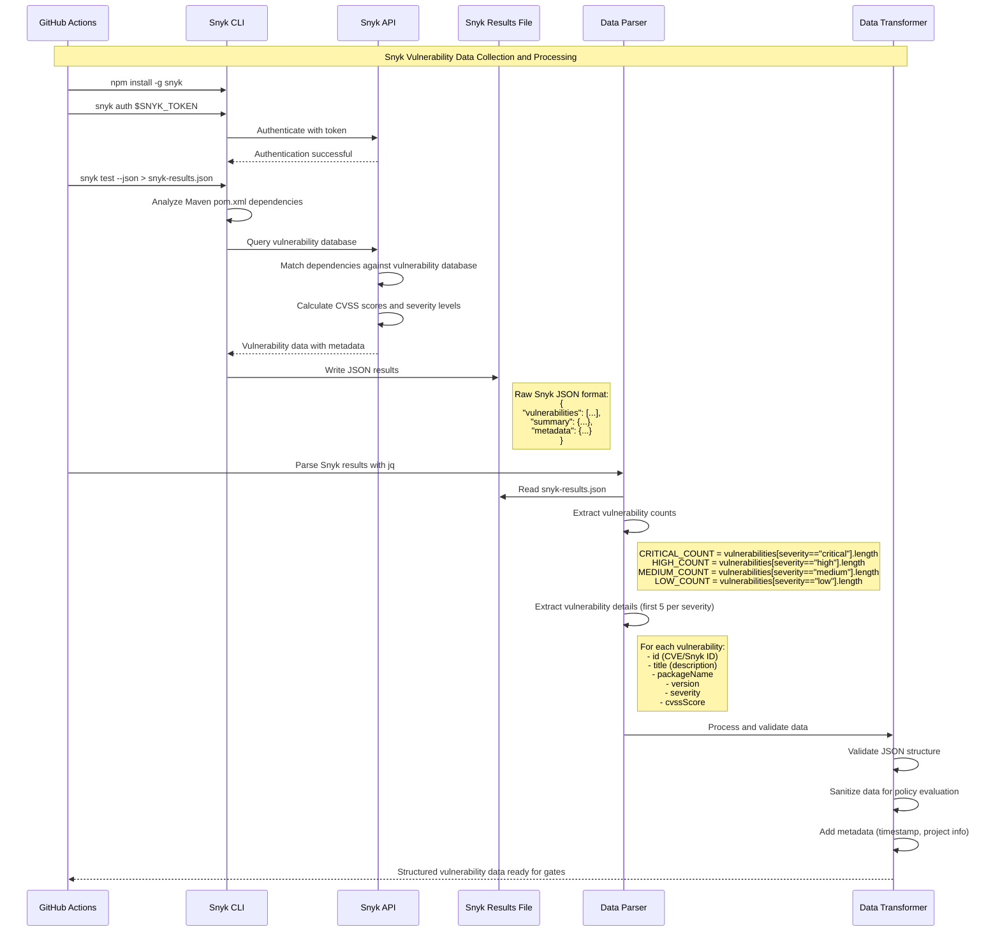
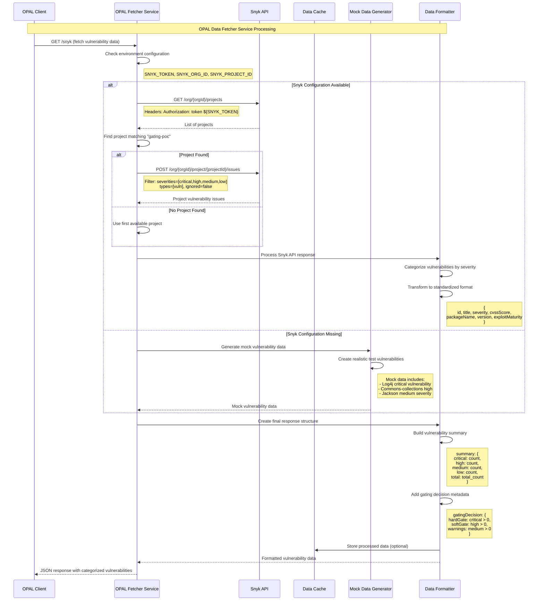
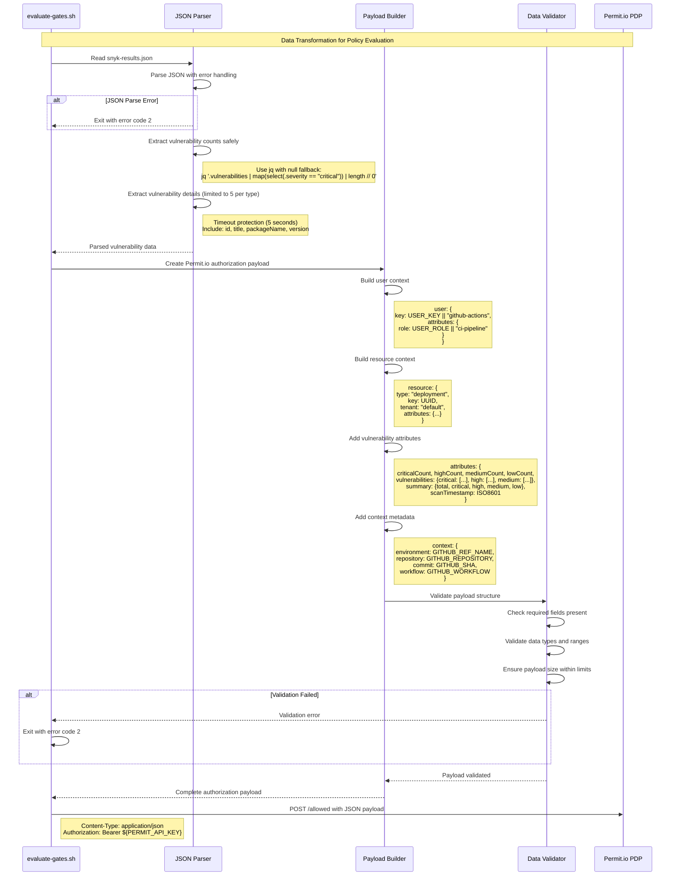
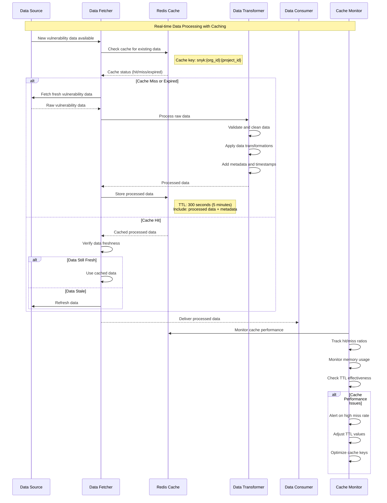
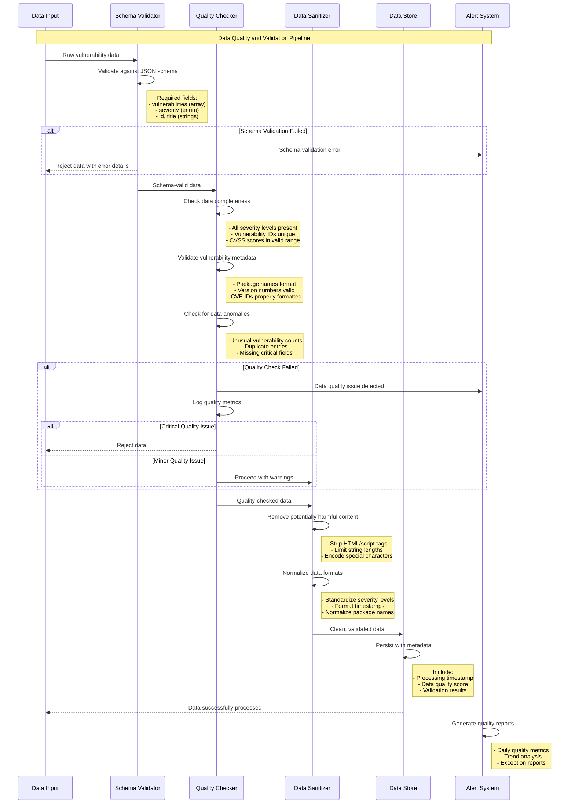

# Data Flow and Processing - Sequence Diagrams

This document provides detailed sequence diagrams showing data collection, transformation, and processing flows in the Permit.io gating system.

## Snyk Data Collection and Processing

## OPAL Data Fetcher Processing

## Policy Data Transformation for Permit.io

## Real-time Data Processing and Caching

## Data Quality and Validation Pipeline

## Data Flow Summary

### Data Sources
1. **Snyk API**: Real-time vulnerability scanning results
2. **Mock Data**: Testing and development scenarios
3. **GitHub Context**: Repository and workflow metadata

### Data Transformations
1. **Extraction**: Parse JSON vulnerability data with jq
2. **Categorization**: Group by severity (critical/high/medium/low)
3. **Sanitization**: Remove sensitive data, limit payload size
4. **Formatting**: Convert to Permit.io policy evaluation format

### Data Validation
1. **Schema Validation**: Ensure required fields and data types
2. **Quality Checks**: Verify data completeness and consistency
3. **Security Sanitization**: Remove potentially harmful content
4. **Size Limits**: Prevent payload overflow attacks

### Caching Strategy
1. **Redis Caching**: Store processed vulnerability data
2. **TTL Management**: 5-minute cache lifetime for fresh data
3. **Cache Keys**: Organized by organization and project
4. **Performance Monitoring**: Track hit rates and optimization

### Error Handling
1. **Graceful Degradation**: Fall back to mock data on API failures
2. **Retry Logic**: Automatic retry with exponential backoff
3. **Validation Errors**: Clear error messages and exit codes
4. **Monitoring**: Real-time alerts on data quality issues