# Error Handling and Recovery - Sequence Diagrams

This document provides comprehensive sequence diagrams showing error handling, recovery mechanisms, and failure scenarios in the Permit.io gating system.

## PDP Connection Failure and Recovery

```mermaid
sequenceDiagram
    participant Script as evaluate-gates.sh
    participant PDP as Permit.io PDP
    participant Docker as Docker Service
    participant Retry as Retry Logic
    participant Fallback as Fallback Handler
    participant Alert as Alert System

    Note over Script, Alert: PDP Connection Failure and Recovery

    Script->>PDP: curl http://localhost:7001/healthy (initial check)
    
    alt PDP Not Responding
        PDP-->>Script: Connection timeout/refused
        
        Script->>Retry: Initialize retry loop (max 30 attempts)
        
        loop Retry Logic (2-second intervals)
            Retry->>PDP: Health check attempt
            
            alt Still Not Ready
                PDP-->>Retry: Connection failed
                Retry->>Retry: Wait 2 seconds
                Retry->>Retry: Increment attempt counter
                
                alt Max Attempts Reached (30)
                    Retry->>Alert: PDP health check timeout
                    Retry->>Docker: Check container status
                    
                    Docker->>Docker: docker ps | grep permit-pdp
                    alt Container Not Running
                        Docker-->>Retry: Container stopped/missing
                        Retry->>Fallback: Container startup failed
                    else Container Running But Unhealthy
                        Docker-->>Retry: Container running
                        Retry->>Docker: docker logs permit-pdp
                        Retry->>Fallback: Service internal error
                    end
                    
                    Fallback->>Script: ✗ PDP failed to become ready
                    Script->>Script: Exit with code 2 (failure)
                end
            else PDP Ready
                PDP-->>Retry: 200 OK
                Retry->>Script: ✓ PDP is ready
            end
        end
    else PDP Responding
        PDP-->>Script: 200 OK (healthy)
        Script->>Script: Continue with gate evaluation
    end
```



## Authentication and Authorization Errors


## Data Processing Errors


## Service Dependency Failures

```mermaid
sequenceDiagram
    participant Pipeline as CI/CD Pipeline
    participant Docker as Docker Compose
    participant PDP as Permit.io PDP
    participant Redis as Redis Cache
    participant OPAL as OPAL Fetcher
    participant Recovery as Recovery Handler

    Note over Pipeline, Recovery: Service Dependency Failure Management

    Pipeline->>Docker: docker-compose up -d
    
    Docker->>Redis: Start Redis container
    alt Redis Startup Failed
        Redis-->>Docker: Container failed to start
        Docker->>Recovery: Redis dependency failure
        Recovery->>Docker: Check port conflicts (6379)
        Recovery->>Docker: Check available memory
        Recovery->>Docker: Restart with different configuration
        
        alt Recovery Successful
            Redis-->>Recovery: Container started
        else Recovery Failed
            Recovery->>Pipeline: ✗ Redis startup failed
            Pipeline->>Pipeline: Exit pipeline with error
        end
    end
    
    Docker->>PDP: Start PDP container (depends on Redis)
    alt PDP Startup Failed
        PDP-->>Docker: Container failed to start
        Docker->>Recovery: PDP dependency failure
        
        Recovery->>Redis: Check Redis connectivity
        alt Redis Not Available
            Recovery->>Docker: Restart Redis first
            Recovery->>Docker: Wait for Redis health
            Recovery->>PDP: Retry PDP startup
        else Redis Available
            Recovery->>Recovery: Check PDP configuration
            Recovery->>Recovery: Validate PERMIT_API_KEY
            Recovery->>Recovery: Check port conflicts (7766)
            
            alt Configuration Valid
                Recovery->>PDP: Restart with corrected config
            else Invalid Configuration
                Recovery->>Pipeline: ✗ PDP configuration error
                Pipeline->>Pipeline: Exit with configuration guidance
            end
        end
    end
    
    Docker->>OPAL: Start OPAL Fetcher
    alt OPAL Startup Failed
        OPAL-->>Docker: Container failed to start
        Docker->>Recovery: OPAL dependency failure
        
        Recovery->>Recovery: Check if OPAL is required for current test
        alt OPAL Required
            Recovery->>OPAL: Diagnose startup failure
            Recovery->>Recovery: Check SNYK_TOKEN availability
            Recovery->>Recovery: Validate Dockerfile
            Recovery->>OPAL: Restart with debugging
        else OPAL Optional
            Recovery->>Pipeline: Continue without OPAL (use mock data)
        end
    end
    
    Pipeline->>Docker: Check overall service health
    Docker->>Docker: Verify all required services running
    
    alt Critical Services Down
        Docker->>Recovery: Multiple service failures
        Recovery->>Recovery: Assess cascade failure
        Recovery->>Docker: Attempt full restart
        
        alt Full Restart Successful
            Docker-->>Recovery: All services healthy
            Recovery->>Pipeline: Continue with services
        else Full Restart Failed
            Recovery->>Pipeline: ✗ Infrastructure failure
            Pipeline->>Pipeline: Exit with infrastructure error
        end
    end
```



## Network and Connectivity Issues


## Graceful Degradation Scenarios


## Error Recovery Procedures


## Error Response Formats and Exit Codes

### Exit Code Definitions
- **0**: Success - All gates passed or valid override
- **1**: Warning - Soft gates triggered, deployment allowed with warnings
- **2**: Failure - Hard gates failed, configuration errors, or system failures

### Error Response Examples

#### Configuration Error Response
```bash
Error: PERMIT_API_KEY environment variable is not set
Please set it by running: export PERMIT_API_KEY=your_api_key
Or create a .env file in the project root with: PERMIT_API_KEY=your_api_key

Exit code: 2
```

#### PDP Connection Error Response
```bash
✗ PDP failed to become ready after 30 attempts
Check:
1. Docker container status: docker ps | grep permit-pdp
2. Container logs: docker logs permit-pdp  
3. Network connectivity: curl http://localhost:7766/healthy
4. API key validity in Permit.io dashboard

Exit code: 2
```

#### Authentication Error Response
```bash
✗ API authentication failed (401 Unauthorized)
Please check your PERMIT_API_KEY
Make sure it's a valid API key from https://app.permit.io

Exit code: 2
```

### Recovery Recommendations

#### Immediate Actions
1. **Check Configuration**: Verify all environment variables are set
2. **Validate Connectivity**: Test network connections to external services
3. **Review Logs**: Examine container and service logs for specific errors
4. **Health Checks**: Verify all dependent services are running

#### Escalation Procedures
1. **Level 1**: Automatic retry with exponential backoff
2. **Level 2**: Fallback to cached data or alternative services
3. **Level 3**: Manual intervention with detailed error reporting
4. **Level 4**: Security team involvement for security-related issues