# Safe Deployment Gate Decision Matrix - Flow Diagrams

This document provides comprehensive flow diagrams showing the Safe Deployment Gate decision logic using inverted ABAC, policy evaluation, and different gate scenarios with Resource Set matching.

## Safe Deployment Gate Flow Overview

```mermaid
flowchart TD
    Start([Start Gate Evaluation]) --> LoadData[Load Vulnerability Data]
    LoadData --> CheckCritical{Critical Vulnerabilities > 0?}
    
    CheckCritical -->|No| SafeGate[🟢 Safe Deployment Gate Matches]
    SafeGate --> CheckHighSafe{High Vulnerabilities > 0?}
    CheckHighSafe -->|Yes| SoftGate[⚠️ SOFT GATE WARNING]
    CheckHighSafe -->|No| CheckMediumSafe{Medium Vulnerabilities > 0?}
    CheckMediumSafe -->|Yes| InfoGate[ℹ️ INFO GATE WARNING]
    CheckMediumSafe -->|No| CleanPass[✅ CLEAN PASS]
    
    CheckCritical -->|Yes| BaseResource[🔴 Falls back to Base Deployment]
    BaseResource --> CheckRole{User Role?}
    CheckRole -->|developer/ci-pipeline| HardFail[❌ HARD GATE FAIL]
    CheckRole -->|editor/Security Officer| EditorOverride[🔓 OVERRIDE ALLOWED]
    
    CleanPass --> ExitSuccess[Exit Code 0]
    SoftGate --> ExitWarning[Exit Code 1]
    InfoGate --> ExitWarning
    EditorOverride --> ExitSuccess
    HardFail --> ExitFail[Exit Code 2]
    
    style SafeGate fill:#44ff44
    style BaseResource fill:#ff6666
    style HardFail fill:#ff4444
    style EditorOverride fill:#ffaa44
    style SoftGate fill:#ffff44
    style InfoGate fill:#44aaff
    style CleanPass fill:#00ff00
```



## Critical Vulnerability with Safe Deployment Gate Flow

```mermaid
sequenceDiagram
    participant Script as evaluate-gates.sh
    participant PDP as Permit.io PDP
    participant ResourceSet as Safe Deployment Gate
    participant Audit as Audit Log
    participant Pipeline as CI/CD Pipeline

    Note over Script, Pipeline: Critical Vulnerability - Developer Access Denied

    Script->>PDP: Authorization request with criticalCount > 0
    Note right of Script: Example: criticalCount = 1<br/>User: developer<br/>Resource: deployment<br/>Critical vulnerability: CVE-2021-44228 (Log4j)

    PDP->>ResourceSet: Check Safe Deployment Gate condition
    Note right of ResourceSet: Condition: resource.criticalCount equals 0<br/>Actual: criticalCount = 1<br/>Result: NO MATCH

    ResourceSet-->>PDP: Safe Deployment Gate does not match
    PDP->>PDP: Fallback to base deployment resource
    
    PDP->>PDP: Check developer role permissions on base deployment
    Note right of PDP: Developer role has NO deploy permission<br/>on base deployment resource

    PDP->>PDP: Authorization decision: DENY
    PDP->>Audit: Log access denied
    Note right of Audit: User: developer<br/>Action: deploy<br/>Decision: DENY<br/>Reason: No permission on base deployment<br/>Critical vulns: 1

    PDP-->>Script: {"allow": false}

    Script->>Script: Parse response - allow = false
    Script->>Script: ❌ DECISION: FAIL - ABAC Rule Blocking
    Script->>Script: Display critical vulnerabilities
    Note right of Script: 🔴 Critical Vulnerabilities Found (1):<br/>  • org.apache.logging.log4j:log4j-core@2.14.1: Remote Code Execution (RCE)

    Script->>Script: 🛑 DEPLOYMENT BLOCKED - Safe Deployment Gate not matched
    Script->>Script: Display recommendations
    Note right of Script: 📌 Developer Access Restricted:<br/>  • Fix critical vulnerabilities to enable Safe Deployment Gate<br/>  • Or request editor override for emergency deployment

    Script->>Pipeline: Exit code 2 (failure)
    Pipeline->>Pipeline: ❌ Safe Deployment Gate failed - deployment blocked
    Pipeline->>Pipeline: Stop pipeline execution
```



## Safe Deployment with High Vulnerabilities Flow

```mermaid
sequenceDiagram
    participant Script as evaluate-gates.sh
    participant PDP as Permit.io PDP
    participant ResourceSet as Safe Deployment Gate
    participant Audit as Audit Log
    participant Pipeline as CI/CD Pipeline

    Note over Script, Pipeline: Safe Deployment with High Severity Vulnerabilities

    Script->>PDP: Authorization request with criticalCount = 0, highCount > 0
    Note right of Script: Example: criticalCount = 0, highCount = 2<br/>User: developer<br/>High vulnerabilities: CVE-2015-6420 (Commons Collections)

    PDP->>ResourceSet: Check Safe Deployment Gate condition
    Note right of ResourceSet: Condition: resource.criticalCount equals 0<br/>Actual: criticalCount = 0<br/>Result: MATCH ✅

    ResourceSet-->>PDP: Safe Deployment Gate matches!
    PDP->>PDP: Check developer role permissions on Safe Deployment Gate
    Note right of PDP: Developer role has deploy permission<br/>on Safe Deployment Gate resource

    PDP->>PDP: Authorization decision: ALLOW
    PDP->>Audit: Log safe deployment allowed
    Note right of Audit: User: developer<br/>Action: deploy<br/>Decision: ALLOW<br/>Reason: Safe Deployment Gate matched<br/>High vulns: 2 (non-blocking)

    PDP-->>Script: {"allow": true}

    Script->>Script: Parse response - allow = true
    Script->>Script: ✅ DECISION: PASS - Safe Deployment Gate matched
    Script->>Script: Analyze non-blocking vulnerabilities
    Script->>Script: ⚠️ SOFT GATE: High severity vulnerabilities detected
    Script->>Script: Display high severity vulnerabilities
    Note right of Script: High severity vulnerabilities (showing first 5):<br/>  • commons-collections:commons-collections@3.2.1: Deserialization of Untrusted Data

    Script->>Script: ⚡ Safe deployment proceeding with warnings
    Script->>Script: Review recommended before production deployment

    Script->>Pipeline: Exit code 1 (warning)
    Pipeline->>Pipeline: ✅ Safe Deployment Gate passed - proceeding with warnings
    Pipeline->>Pipeline: Continue to next job (deployment allowed)
```



## Editor Override with Safe Deployment Gate Flow


## Safe Deployment with Medium Vulnerabilities Flow

```mermaid
sequenceDiagram
    participant Script as evaluate-gates.sh
    participant PDP as Permit.io PDP
    participant ResourceSet as Safe Deployment Gate
    participant Pipeline as CI/CD Pipeline

    Note over Script, Pipeline: Safe Deployment with Medium Severity Vulnerabilities

    Script->>PDP: Authorization request with mediumCount > 0, no critical/high
    Note right of Script: Example: mediumCount = 3<br/>User: developer<br/>Medium vulnerabilities: CVE-2019-xxx (Jackson Databind)

    PDP->>ResourceSet: Check Safe Deployment Gate condition
    Note right of ResourceSet: Condition: resource.criticalCount equals 0<br/>Actual: criticalCount = 0<br/>Result: MATCH ✅

    ResourceSet-->>PDP: Safe Deployment Gate matches!
    PDP->>PDP: Check developer role permissions on Safe Deployment Gate
    Note right of PDP: Developer role has deploy permission<br/>on Safe Deployment Gate resource

    PDP->>PDP: Authorization decision: ALLOW
    PDP-->>Script: {"allow": true}

    Script->>Script: Parse response - allow = true
    Script->>Script: ✅ DECISION: PASS - Safe Deployment Gate matched
    Script->>Script: Analyze non-blocking vulnerabilities
    Script->>Script: ℹ️ INFO GATE: Medium severity vulnerabilities detected
    Script->>Script: Display medium severity vulnerabilities
    Note right of Script: Medium severity vulnerabilities (showing first 5):<br/>  • com.fasterxml.jackson.core:jackson-databind@2.9.10.1: Deserialization

    Script->>Script: 💡 Safe deployment proceeding with info
    Script->>Script: Consider remediation in next maintenance window

    Script->>Pipeline: Exit code 1 (informational warning)
    Pipeline->>Pipeline: ✅ Safe Deployment Gate passed - proceeding with info
    Pipeline->>Pipeline: Continue deployment (medium vulnerabilities noted)
```



## Clean Safe Deployment Flow

```mermaid
sequenceDiagram
    participant Script as evaluate-gates.sh
    participant PDP as Permit.io PDP
    participant ResourceSet as Safe Deployment Gate
    participant Pipeline as CI/CD Pipeline

    Note over Script, Pipeline: Clean Build - No Vulnerabilities (Perfect Safe Deployment)

    Script->>PDP: Authorization request with all vulnerability counts = 0
    Note right of Script: criticalCount = 0<br/>highCount = 0<br/>mediumCount = 0<br/>lowCount = 0<br/>User: developer

    PDP->>ResourceSet: Check Safe Deployment Gate condition
    Note right of ResourceSet: Condition: resource.criticalCount equals 0<br/>Actual: criticalCount = 0<br/>Result: PERFECT MATCH ✅

    ResourceSet-->>PDP: Safe Deployment Gate matches perfectly!
    PDP->>PDP: Check developer role permissions on Safe Deployment Gate
    Note right of PDP: Developer role has deploy permission<br/>on Safe Deployment Gate resource

    PDP->>PDP: Authorization decision: ALLOW
    PDP-->>Script: {"allow": true}

    Script->>Script: Parse response - allow = true
    Script->>Script: ✅ DECISION: PASS - Safe Deployment Gate matched
    Script->>Script: Analyze vulnerability profile
    Script->>Script: 🎉 CLEAN BUILD: No vulnerabilities detected
    Script->>Script: Display vulnerability summary (all zeros)
    Note right of Script: 📊 Vulnerability Summary:<br/>  • Critical: 0 ✅<br/>  • High: 0 ✅<br/>  • Medium: 0 ✅<br/>  • Low: 0 ✅<br/>  • Total: 0 - CLEAN!

    Script->>Script: 🚀 Perfect safe deployment - no security concerns
    Script->>Script: Deployment can proceed without restrictions

    Script->>Pipeline: Exit code 0 (success)
    Pipeline->>Pipeline: ✅ Safe Deployment Gate passed perfectly
    Pipeline->>Pipeline: Continue to deployment with confidence
```



## Safe Deployment Gate Decision Tree

```mermaid
flowchart TD
    Input[Vulnerability Input Data] --> Critical{criticalCount > 0?}
    
    Critical -->|No| SafeGate[🟢 Safe Deployment Gate<br/>MATCHES]    
    SafeGate --> High{highCount > 0?}
    High -->|Yes| SafeWarning[SAFE DEPLOYMENT<br/>⚠️ With High Vuln Warnings<br/>Exit Code 1]
    High -->|No| Medium{mediumCount > 0?}
    Medium -->|Yes| SafeInfo[SAFE DEPLOYMENT<br/>ℹ️ With Medium Vuln Info<br/>Exit Code 1]
    Medium -->|No| SafeClean[SAFE DEPLOYMENT<br/>✅ Perfect Clean Build<br/>Exit Code 0]
    
    Critical -->|Yes| BaseResource[🔴 Base Deployment<br/>Resource Fallback]
    BaseResource --> RoleCheck{User Role?}
    RoleCheck -->|developer/ci-pipeline| Denied[ACCESS DENIED<br/>❌ No Override Permission<br/>Exit Code 2]
    RoleCheck -->|editor/Security Officer| Override[OVERRIDE ALLOWED<br/>🔓 Emergency Override<br/>Exit Code 0]
    
    style SafeGate fill:#44ff44,stroke:#333,stroke-width:3px
    style BaseResource fill:#ff6666,stroke:#333,stroke-width:3px
    style Denied fill:#ff4444,stroke:#333,stroke-width:2px,color:#fff
    style Override fill:#ffaa44,stroke:#333,stroke-width:2px
    style SafeWarning fill:#ffff44,stroke:#333,stroke-width:2px
    style SafeInfo fill:#44aaff,stroke:#333,stroke-width:2px,color:#fff
    style SafeClean fill:#00ff00,stroke:#333,stroke-width:2px
```



## Safe Deployment Gate Configuration Matrix

| Critical Count | Resource Set Match | User Role | Gate Type | Decision | Exit Code | Action |
|----------------|-------------------|-----------|-----------|----------|-----------|---------|
| 0 | Safe Deployment Gate | Any | Safe Deployment | ALLOW | 0/1* | Deploy Safely |
| > 0 | Base Deployment | developer/ci-pipeline | Access Denied | DENY | 2 | Block Deployment |
| > 0 | Base Deployment | editor/Security Officer | Override Gate | ALLOW | 0 | Override with Audit |

*Exit Code 0 for clean builds, 1 for builds with high/medium vulnerabilities (non-blocking)

### Resource Set Matching Logic

| Condition | Resource Set | Matches When | Available To |
|-----------|-------------|--------------|-------------|
| `criticalCount = 0` | Safe Deployment Gate | No critical vulnerabilities | All roles (developer, editor, Security Officer, ci-pipeline) |
| `criticalCount > 0` | Base Deployment | Critical vulnerabilities present | Override roles only (editor, Security Officer) |

### Vulnerability Level Processing (After Resource Set Match)

| Vulnerability Profile | Safe Deployment Gate Match | Result | Exit Code |
|-----------------------|----------------------------|--------|-----------|
| No vulnerabilities | ✅ YES | Clean Safe Deployment | 0 |
| High/Medium only | ✅ YES | Safe Deployment with Warnings/Info | 1 |
| Critical present | ❌ NO | Falls back to Base Deployment | Depends on role |

## Audit Trail Requirements

### Standard Gate Events
```json
{
  "timestamp": "2025-08-12T15:30:00Z",
  "event_type": "gate_evaluation",
  "user": "github-actions",
  "role": "ci-pipeline",
  "action": "deploy",
  "resource": "deployment",
  "decision": "FAIL",
  "vulnerabilities": {
    "critical": 1,
    "high": 0,
    "medium": 2,
    "low": 3
  },
  "blocking_vulns": [
    {
      "id": "CVE-2021-44228",
      "package": "org.apache.logging.log4j:log4j-core",
      "version": "2.14.1",
      "severity": "critical"
    }
  ]
}
```

### Editor Override Events
```json
{
  "timestamp": "2025-08-12T15:30:00Z",
  "event_type": "editor_override",
  "user": "admin_user",
  "role": "editor",
  "action": "deploy",
  "resource": "deployment",
  "decision": "EDITOR_OVERRIDE",
  "override_reason": "Emergency hotfix deployment",
  "business_justification": "Critical production issue requires immediate fix",
  "vulnerabilities_overridden": {
    "critical": 1,
    "high": 0
  },
  "post_deployment_plan": "Address CVE-2021-44228 within 24 hours",
  "approval_chain": ["security_manager", "engineering_director"],
  "compliance_notification": true
}
```

## Recommendations by Gate Type

### Hard Gate Failure (Critical Vulnerabilities)
1. **Immediate Actions**:
   - Stop deployment pipeline
   - Identify critical vulnerabilities
   - Assess exploitability and impact
   - Prioritize remediation

2. **Remediation Steps**:
   - Update vulnerable dependencies
   - Apply security patches
   - Test fixes thoroughly
   - Re-run security scan

3. **Exception Process**:
   - Document business justification
   - Get security team approval
   - Use editor override with audit trail
   - Implement post-deployment remediation plan

### Soft Gate Warning (High Vulnerabilities)
1. **Review Process**:
   - Assess vulnerability impact
   - Check for available patches
   - Evaluate deployment timing
   - Plan remediation window

2. **Deployment Decision**:
   - Proceed with caution
   - Monitor for exploitation
   - Schedule immediate remediation
   - Document acceptance of risk

### Info Gate (Medium Vulnerabilities)
1. **Planning Actions**:
   - Add to security backlog
   - Schedule maintenance window
   - Monitor for severity escalation
   - Include in next sprint planning

2. **Best Practices**:
   - Keep dependencies current
   - Regular security scanning
   - Vulnerability management process
   - Security awareness training