# Security Gate Decision Matrix - Sequence Diagrams

This document provides comprehensive sequence diagrams showing the security gate decision logic, policy evaluation, and different gate scenarios.

## Gate Decision Flow Overview

```mermaid
flowchart TD
    Start([Start Gate Evaluation]) --> LoadData[Load Vulnerability Data]
    LoadData --> CheckCritical{Critical Vulnerabilities > 0?}
    
    CheckCritical -->|Yes| CheckRole{User Role?}
    CheckRole -->|ci-pipeline| HardFail[❌ HARD GATE FAIL]
    CheckRole -->|editor| EditorOverride[🔓 EDITOR OVERRIDE]
    
    CheckCritical -->|No| CheckHigh{High Vulnerabilities > 0?}
    CheckHigh -->|Yes| SoftGate[⚠️ SOFT GATE WARNING]
    CheckHigh -->|No| CheckMedium{Medium Vulnerabilities > 0?}
    
    CheckMedium -->|Yes| InfoGate[ℹ️ INFO GATE WARNING]
    CheckMedium -->|No| Pass[✅ PASS]
    
    HardFail --> ExitFail[Exit Code 2]
    EditorOverride --> ExitSuccess[Exit Code 0]
    SoftGate --> ExitWarning[Exit Code 1]
    InfoGate --> ExitWarning
    Pass --> ExitSuccess
    
    style HardFail fill:#ff4444
    style EditorOverride fill:#ffaa44
    style SoftGate fill:#ffff44
    style InfoGate fill:#44aaff
    style Pass fill:#44ff44
```



## Critical Vulnerability Hard Gate Flow

```mermaid
sequenceDiagram
    participant Script as evaluate-gates.sh
    participant Policy as gating_policy.rego
    participant PDP as Permit.io PDP
    participant Audit as Audit Log
    participant Pipeline as CI/CD Pipeline

    Note over Script, Pipeline: Critical Vulnerability Hard Gate Scenario

    Script->>Policy: Vulnerability data with criticalCount > 0
    Note right of Script: Example: criticalCount = 1<br/>Critical vulnerability: CVE-2021-44228 (Log4j)

    Policy->>Policy: Execute hard_gate_fail rule
    Note right of Policy: hard_gate_fail if {<br/>    input.resource.attributes.criticalCount > 0<br/>}

    Policy->>Policy: hard_gate_fail = true
    Policy->>Policy: Create CRITICAL_VULNERABILITY violation
    Note right of Policy: {<br/>  "type": "CRITICAL_VULNERABILITY",<br/>  "severity": "CRITICAL",<br/>  "action": "FAIL",<br/>  "message": "Found 1 critical vulnerabilities - Build must be stopped"<br/>}

    Policy->>Policy: determine_overall_result([violations])
    Policy->>Policy: Found violation with action == "FAIL"
    Policy->>Policy: Return {allow: false, decision: "FAIL"}

    Policy-->>PDP: Policy evaluation result
    PDP->>Audit: Log hard gate failure
    Note right of Audit: User: github-actions<br/>Action: deploy<br/>Decision: FAIL<br/>Reason: Critical vulnerabilities<br/>Count: 1

    PDP-->>Script: {allow: false, decision: "FAIL", violations: [...]}

    Script->>Script: Parse response - allow = false
    Script->>Script: ❌ DECISION: FAIL - Hard gate triggered
    Script->>Script: Display critical vulnerabilities
    Note right of Script: 🔴 Critical Vulnerabilities Found (1):<br/>  • org.apache.logging.log4j:log4j-core@2.14.1: Remote Code Execution (RCE)

    Script->>Script: 🛑 DEPLOYMENT BLOCKED
    Script->>Script: Display recommendations
    Note right of Script: 📌 Recommendations:<br/>  • Review and fix critical vulnerabilities<br/>  • Update vulnerable dependencies<br/>  • Run security scan again after fixes

    Script->>Pipeline: Exit code 2 (failure)
    Pipeline->>Pipeline: ❌ Hard gate failed - deployment blocked
    Pipeline->>Pipeline: Stop pipeline execution
```



## High Severity Soft Gate Flow

```mermaid
sequenceDiagram
    participant Script as evaluate-gates.sh
    participant Policy as gating_policy.rego
    participant PDP as Permit.io PDP
    participant Audit as Audit Log
    participant Pipeline as CI/CD Pipeline

    Note over Script, Pipeline: High Severity Soft Gate Scenario

    Script->>Policy: Vulnerability data with highCount > 0, criticalCount = 0
    Note right of Script: Example: highCount = 2<br/>High vulnerabilities: CVE-2015-6420 (Commons Collections)

    Policy->>Policy: Execute hard_gate_fail rule
    Policy->>Policy: hard_gate_fail = false (no critical vulns)

    Policy->>Policy: Execute soft_gate_warn rule
    Note right of Policy: soft_gate_warn if {<br/>    input.resource.attributes.highCount > 0<br/>}

    Policy->>Policy: soft_gate_warn = true
    Policy->>Policy: Create HIGH_VULNERABILITY violation
    Note right of Policy: {<br/>  "type": "HIGH_VULNERABILITY",<br/>  "severity": "HIGH",<br/>  "action": "WARN",<br/>  "message": "Found 2 high severity vulnerabilities - Review recommended"<br/>}

    Policy->>Policy: determine_overall_result([violations])
    Policy->>Policy: Found violation with action == "WARN"
    Policy->>Policy: Return {allow: true, decision: "PASS_WITH_WARNINGS"}

    Policy-->>PDP: Policy evaluation result
    PDP->>Audit: Log soft gate warning
    Note right of Audit: User: github-actions<br/>Action: deploy<br/>Decision: PASS_WITH_WARNINGS<br/>High vulns: 2

    PDP-->>Script: {allow: true, decision: "PASS_WITH_WARNINGS", violations: [...]}

    Script->>Script: Parse response - allow = true
    Script->>Script: ⚠️ DECISION: PASS WITH WARNINGS - Soft gate triggered
    Script->>Script: Display high severity vulnerabilities
    Note right of Script: High severity vulnerabilities (showing first 5):<br/>  • commons-collections:commons-collections@3.2.1: Deserialization of Untrusted Data

    Script->>Script: ⚡ High severity vulnerabilities detected
    Script->>Script: Review recommended before production deployment

    Script->>Pipeline: Exit code 1 (warning)
    Pipeline->>Pipeline: ⚠️ Soft gate warnings - proceeding with caution
    Pipeline->>Pipeline: Continue to next job (deployment allowed)
```



## Editor Override Flow

```mermaid
sequenceDiagram
    participant Admin as Security Admin
    participant Script as evaluate-gates.sh
    participant Policy as gating_policy.rego
    participant PDP as Permit.io PDP
    participant Audit as Audit Log
    participant Pipeline as CI/CD Pipeline

    Note over Admin, Pipeline: Editor Override Emergency Scenario

    Admin->>Admin: Emergency deployment required
    Admin->>Admin: Document business justification
    Admin->>Script: Set USER_ROLE=editor, USER_KEY=admin_user

    Script->>Policy: Authorization request with editor role
    Note right of Script: user.attributes.role = "editor"<br/>criticalCount = 1 (still present)

    Policy->>Policy: Execute hard_gate_fail rule
    Policy->>Policy: hard_gate_fail = true (critical vulns present)

    Policy->>Policy: Check user role in context
    Policy->>Policy: input.user.attributes.role == "editor"

    Policy->>Policy: Editor override logic
    Note right of Policy: If user is editor AND has deploy permission:<br/>Allow deployment despite critical vulnerabilities

    Policy->>Policy: Create EDITOR_OVERRIDE decision
    Policy->>Policy: Return {allow: true, decision: "EDITOR_OVERRIDE"}

    Policy-->>PDP: Override authorization decision
    PDP->>Audit: Log editor override event
    Note right of Audit: CRITICAL OVERRIDE EVENT:<br/>User: admin_user<br/>Role: editor<br/>Critical vulns: 1<br/>Override reason: Emergency deployment<br/>Timestamp: 2025-08-12T15:30:00Z

    PDP-->>Script: {allow: true, decision: "EDITOR_OVERRIDE", audit_trail: {...}}

    Script->>Script: Detect is_editor_override = true
    Script->>Script: 🔓 DECISION: EDITOR OVERRIDE
    Script->>Script: Display override context
    Note right of Script: ⚠️ Editor Override Active:<br/>  • User Role: editor<br/>  • Critical vulnerabilities present: 1

    Script->>Script: Display critical vulnerabilities being overridden
    Note right of Script: 🔴 Critical Vulnerabilities (Editor Override Applied):<br/>  • org.apache.logging.log4j:log4j-core@2.14.1: Remote Code Execution (RCE)

    Script->>Script: ⚡ DEPLOYMENT PROCEEDING: Editor has overridden security gates
    Script->>Script: Ensure critical vulnerabilities are addressed post-deployment

    Script->>Pipeline: Exit code 0 (proceed with override)
    Pipeline->>Pipeline: ⚠️ Gates overridden by user
    Pipeline->>Pipeline: Continue deployment with audit trail

    Note over Admin: Post-deployment Actions Required:
    Note over Admin: 1. Address critical vulnerabilities immediately
    Note over Admin: 2. Document incident and justification
    Note over Admin: 3. Security review and lessons learned
    Note over Admin: 4. Revert to normal gate enforcement
```



## Medium Severity Info Gate Flow

```mermaid
sequenceDiagram
    participant Script as evaluate-gates.sh
    participant Policy as gating_policy.rego
    participant PDP as Permit.io PDP
    participant Pipeline as CI/CD Pipeline

    Note over Script, Pipeline: Medium Severity Info Gate Scenario

    Script->>Policy: Vulnerability data with mediumCount > 0, no critical/high
    Note right of Script: Example: mediumCount = 3<br/>Medium vulnerabilities: CVE-2019-xxx (Jackson Databind)

    Policy->>Policy: Execute hard_gate_fail rule
    Policy->>Policy: hard_gate_fail = false (no critical vulns)

    Policy->>Policy: Execute soft_gate_warn rule
    Policy->>Policy: soft_gate_warn = false (no high vulns)

    Policy->>Policy: Execute medium_warn rule
    Note right of Policy: medium_warn if {<br/>    input.resource.attributes.mediumCount > 0<br/>}

    Policy->>Policy: medium_warn = true
    Policy->>Policy: Create MEDIUM_VULNERABILITY violation
    Note right of Policy: {<br/>  "type": "MEDIUM_VULNERABILITY",<br/>  "severity": "MEDIUM",<br/>  "action": "INFO",<br/>  "message": "Found 3 medium severity vulnerabilities - Consider reviewing"<br/>}

    Policy->>Policy: determine_overall_result([violations])
    Policy->>Policy: No FAIL or WARN actions, only INFO
    Policy->>Policy: Return {allow: true, decision: "PASS_WITH_INFO"}

    Policy-->>PDP: Policy evaluation result
    PDP-->>Script: {allow: true, decision: "PASS_WITH_INFO", violations: [...]}

    Script->>Script: Parse response - allow = true
    Script->>Script: ℹ️ DECISION: PASS WITH INFO - Informational findings
    Script->>Script: Display medium severity vulnerabilities
    Note right of Script: Medium severity vulnerabilities (showing first 5):<br/>  • com.fasterxml.jackson.core:jackson-databind@2.9.10.1: Deserialization

    Script->>Script: 💡 Medium severity vulnerabilities detected
    Script->>Script: Consider remediation in next maintenance window

    Script->>Pipeline: Exit code 1 (informational warning)
    Pipeline->>Pipeline: Continue deployment (info only)
```



## Clean Build Pass Flow

```mermaid
sequenceDiagram
    participant Script as evaluate-gates.sh
    participant Policy as gating_policy.rego
    participant PDP as Permit.io PDP
    participant Pipeline as CI/CD Pipeline

    Note over Script, Pipeline: Clean Build - No Vulnerabilities

    Script->>Policy: Vulnerability data with all counts = 0
    Note right of Script: criticalCount = 0<br/>highCount = 0<br/>mediumCount = 0<br/>lowCount = 0

    Policy->>Policy: Execute hard_gate_fail rule
    Policy->>Policy: hard_gate_fail = false (criticalCount = 0)

    Policy->>Policy: Execute soft_gate_warn rule
    Policy->>Policy: soft_gate_warn = false (highCount = 0)

    Policy->>Policy: Execute medium_warn rule
    Policy->>Policy: medium_warn = false (mediumCount = 0)

    Policy->>Policy: evaluate_gates function
    Policy->>Policy: No violations created (all counts = 0)
    Policy->>Policy: determine_overall_result([]) - empty violations array

    Policy->>Policy: count(violations) == 0
    Policy->>Policy: Return {allow: true, decision: "PASS"}

    Policy-->>PDP: Policy evaluation result
    PDP-->>Script: {allow: true, decision: "PASS", violations: []}

    Script->>Script: Parse response - allow = true, decision = "PASS"
    Script->>Script: ✅ DECISION: PASS - All security gates passed
    Script->>Script: Display vulnerability summary (all zeros)
    Note right of Script: 📊 Vulnerability Summary:<br/>  • Critical: 0<br/>  • High: 0<br/>  • Medium: 0<br/>  • Low: 0<br/>  • Total: 0

    Script->>Script: 🎉 No blocking vulnerabilities found. Deployment can proceed.

    Script->>Pipeline: Exit code 0 (success)
    Pipeline->>Pipeline: ✅ All security gates passed
    Pipeline->>Pipeline: Continue to deployment
```



## Policy Evaluation Decision Tree

```mermaid
flowchart TD
    Input[Vulnerability Input Data] --> Critical{criticalCount > 0?}
    
    Critical -->|Yes| RoleCheck{User Role?}
    RoleCheck -->|ci-pipeline| Fail[FAIL<br/>❌ Hard Gate<br/>Exit Code 2]
    RoleCheck -->|editor| Override[EDITOR_OVERRIDE<br/>🔓 Emergency Override<br/>Exit Code 0]
    
    Critical -->|No| High{highCount > 0?}
    High -->|Yes| Warning[PASS_WITH_WARNINGS<br/>⚠️ Soft Gate<br/>Exit Code 1]
    High -->|No| Medium{mediumCount > 0?}
    
    Medium -->|Yes| Info[PASS_WITH_INFO<br/>ℹ️ Info Gate<br/>Exit Code 1]
    Medium -->|No| Clean[PASS<br/>✅ Clean Build<br/>Exit Code 0]
    
    style Fail fill:#ff4444,stroke:#333,stroke-width:2px,color:#fff
    style Override fill:#ffaa44,stroke:#333,stroke-width:2px
    style Warning fill:#ffff44,stroke:#333,stroke-width:2px
    style Info fill:#44aaff,stroke:#333,stroke-width:2px,color:#fff
    style Clean fill:#44ff44,stroke:#333,stroke-width:2px
```



## Gate Configuration Matrix

| Severity | Count | User Role | Gate Type | Decision | Exit Code | Action |
|----------|-------|-----------|-----------|----------|-----------|---------|
| Critical | > 0 | ci-pipeline | Hard Gate | FAIL | 2 | Block Deployment |
| Critical | > 0 | editor | Override | EDITOR_OVERRIDE | 0 | Allow with Audit |
| High | > 0 | Any | Soft Gate | PASS_WITH_WARNINGS | 1 | Allow with Warning |
| Medium | > 0 | Any | Info Gate | PASS_WITH_INFO | 1 | Allow with Info |
| None | 0 | Any | Pass | PASS | 0 | Allow |

## Audit Trail Requirements

### Standard Gate Events
```json
{
  "timestamp": "2025-08-12T15:30:00Z",
  "event_type": "gate_evaluation",
  "user": "github-actions",
  "role": "ci-pipeline",
  "action": "deploy",
  "resource": "deployment",
  "decision": "FAIL",
  "vulnerabilities": {
    "critical": 1,
    "high": 0,
    "medium": 2,
    "low": 3
  },
  "blocking_vulns": [
    {
      "id": "CVE-2021-44228",
      "package": "org.apache.logging.log4j:log4j-core",
      "version": "2.14.1",
      "severity": "critical"
    }
  ]
}
```

### Editor Override Events
```json
{
  "timestamp": "2025-08-12T15:30:00Z",
  "event_type": "editor_override",
  "user": "admin_user",
  "role": "editor",
  "action": "deploy",
  "resource": "deployment",
  "decision": "EDITOR_OVERRIDE",
  "override_reason": "Emergency hotfix deployment",
  "business_justification": "Critical production issue requires immediate fix",
  "vulnerabilities_overridden": {
    "critical": 1,
    "high": 0
  },
  "post_deployment_plan": "Address CVE-2021-44228 within 24 hours",
  "approval_chain": ["security_manager", "engineering_director"],
  "compliance_notification": true
}
```

## Recommendations by Gate Type

### Hard Gate Failure (Critical Vulnerabilities)
1. **Immediate Actions**:
   - Stop deployment pipeline
   - Identify critical vulnerabilities
   - Assess exploitability and impact
   - Prioritize remediation

2. **Remediation Steps**:
   - Update vulnerable dependencies
   - Apply security patches
   - Test fixes thoroughly
   - Re-run security scan

3. **Exception Process**:
   - Document business justification
   - Get security team approval
   - Use editor override with audit trail
   - Implement post-deployment remediation plan

### Soft Gate Warning (High Vulnerabilities)
1. **Review Process**:
   - Assess vulnerability impact
   - Check for available patches
   - Evaluate deployment timing
   - Plan remediation window

2. **Deployment Decision**:
   - Proceed with caution
   - Monitor for exploitation
   - Schedule immediate remediation
   - Document acceptance of risk

### Info Gate (Medium Vulnerabilities)
1. **Planning Actions**:
   - Add to security backlog
   - Schedule maintenance window
   - Monitor for severity escalation
   - Include in next sprint planning

2. **Best Practices**:
   - Keep dependencies current
   - Regular security scanning
   - Vulnerability management process
   - Security awareness training