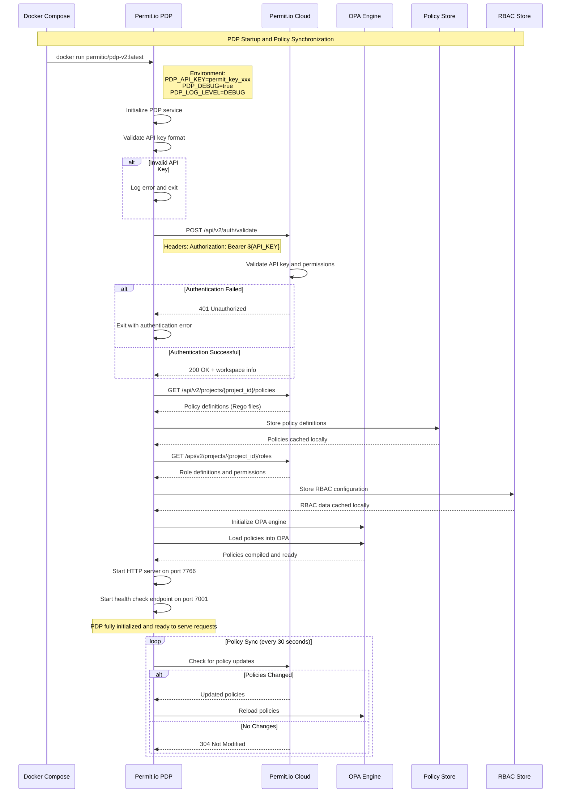
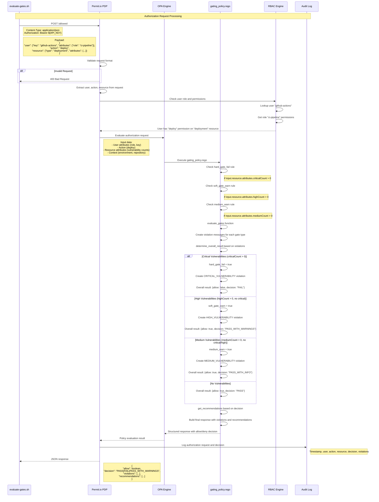
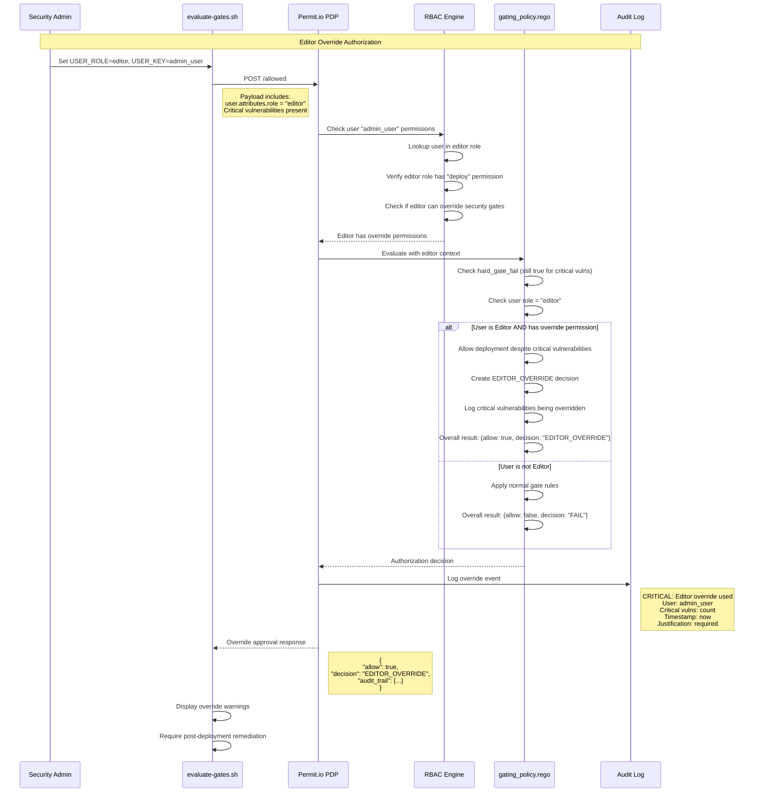
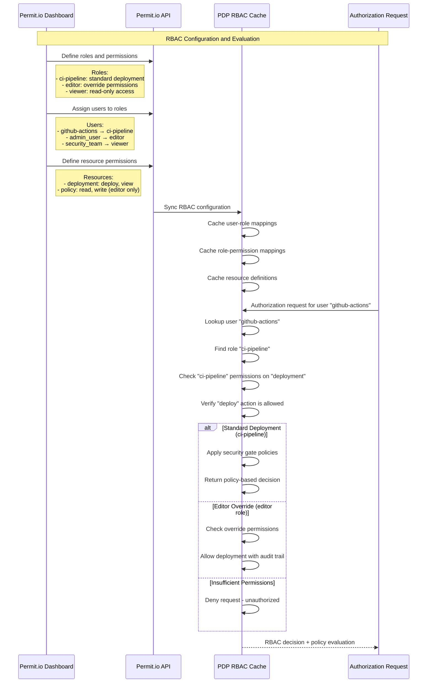
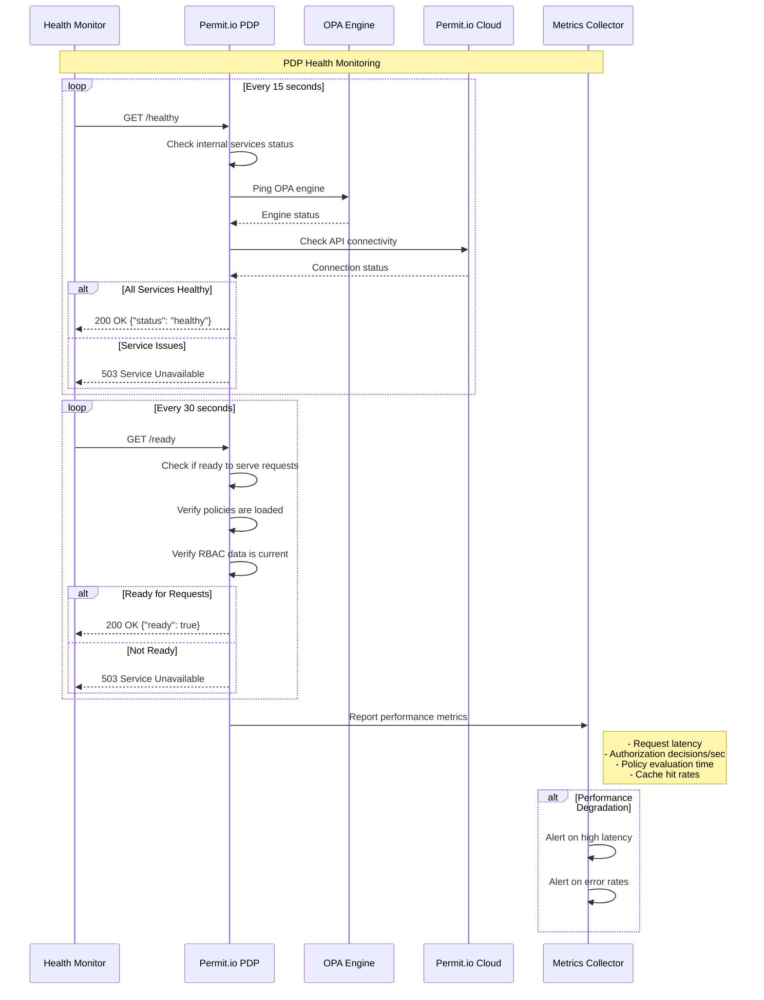

# Permit.io PDP Integration Flow - Sequence Diagrams

This document provides detailed sequence diagrams showing the Permit.io Policy Decision Point (PDP) integration and authorization flows.

## PDP Initialization and Policy Synchronization



## Authorization Request Processing



## Editor Override Authorization Flow



## Role-Based Access Control (RBAC) Details



## Health Check and Monitoring



## API Response Formats

### Standard Authorization Response
```json
{
  "allow": true,
  "decision": "PASS_WITH_WARNINGS",
  "timestamp": 1693840800000,
  "project_id": "deployment-001",
  "summary": {
    "critical_count": 0,
    "high_count": 2,
    "medium_count": 5,
    "total_vulnerabilities": 7
  },
  "violations": [
    {
      "type": "HIGH_VULNERABILITY",
      "severity": "HIGH",
      "action": "WARN",
      "message": "Found 2 high severity vulnerabilities - Review recommended",
      "vulnerabilities": [...]
    }
  ],
  "recommendations": [
    "High severity vulnerabilities detected - review recommended",
    "Plan remediation for high severity issues"
  ]
}
```

### Editor Override Response
```json
{
  "allow": true,
  "decision": "EDITOR_OVERRIDE",
  "timestamp": 1693840800000,
  "audit_trail": {
    "user": "admin_user",
    "role": "editor",
    "overridden_gates": ["hard_gate_critical"],
    "justification_required": true,
    "critical_vulnerabilities": 1
  },
  "violations": [
    {
      "type": "CRITICAL_VULNERABILITY",
      "severity": "CRITICAL",
      "action": "OVERRIDE",
      "message": "Critical vulnerabilities overridden by editor"
    }
  ]
}
```

## Security Considerations

### Authentication & Authorization
- API key validation on every request
- Role-based access control enforcement
- Permission checking before policy evaluation
- Audit logging for all decisions

### Policy Security
- Policies signed and verified from Permit.io
- Secure policy synchronization over HTTPS
- Local policy caching for performance and resilience
- Policy version control and rollback capability

### Data Protection
- Vulnerability data encrypted in transit
- Sensitive information masked in logs
- API keys stored securely in GitHub Secrets
- Audit trails tamper-evident and immutable